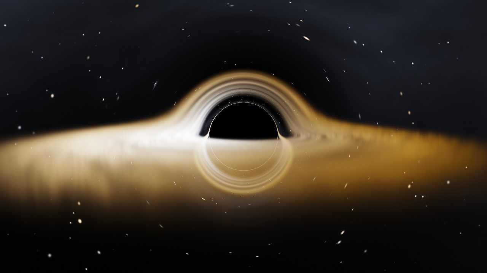

# fable-experiments

Graphics experiments. First up: a physically-based black hole renderer in the
style of Interstellar's Gargantua.



## Black hole renderer

A single WebGL2 fragment shader ray-traces null geodesics through the
Schwarzschild metric — the shadow, the photon ring, and the accretion disk
arcing over the hole all emerge from the integration rather than being painted
in. No textures, no geometry, no libraries.

- **Exact lensing** — each pixel integrates the Cartesian form of the Binet
  equation, `a = -(3/2) rs h² x / r⁵`, with velocity Verlet and adaptive steps
- **Volumetric accretion disk** from the ISCO outward: Shakura–Sunyaev
  temperature profile, blackbody emission, turbulence sheared into spiral
  streaks by differential Keplerian rotation
- **Relativistic light transport** — gravitational redshift, Doppler shift,
  and g³ beaming (the asymmetry Interstellar famously toned down is left on)
- **Lensed starfield** — escaped rays sample a procedural sky with their bent
  direction

Drag to orbit, scroll to zoom. Runs at interactive rates at high resolution on
a reasonable GPU.

### Tutorial

`/tutorial.html` is a write-up of the math behind the renderer, with 2D
diagrams computed live using the same geodesic integrator as the shader —
including an interactive impact-parameter slider showing photon capture at
b = 3√3/2 rs.

## Running

```sh
npm install
npm run dev
```

Open the printed URL for the renderer, or `/tutorial.html` for the math.

## Code layout

- [`src/blackhole/shaders.ts`](src/blackhole/shaders.ts) — the GLSL; physics
  notes in comments
- [`src/blackhole/main.ts`](src/blackhole/main.ts) — WebGL2 setup and orbit
  camera
- [`src/tutorial/main.ts`](src/tutorial/main.ts) — the tutorial's computed
  diagrams
- [`tutorial.html`](tutorial.html) — the write-up

## License

[MIT](LICENSE)
